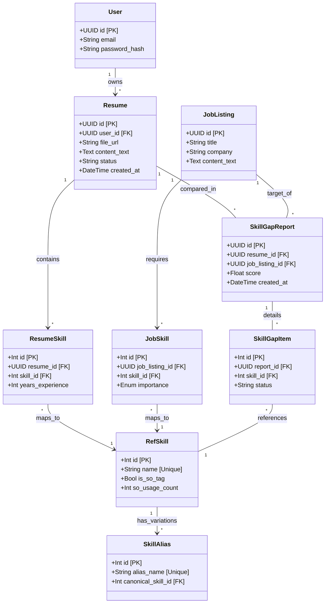
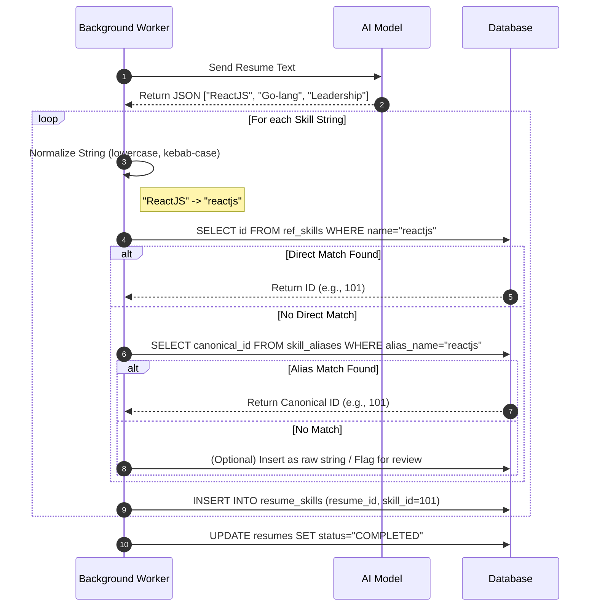
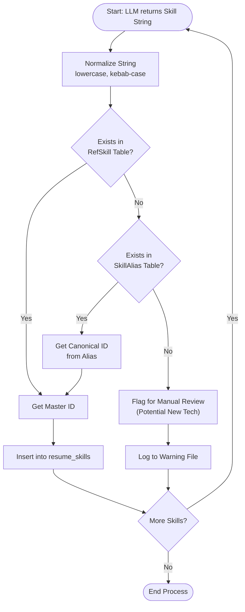

# Job Pairing System (Skill Gap Report) - MVP Design Specification

## 1\. System Description & Requirements Analysis

### 1.1 Overview

The Job Pairing System is a web application that quantifies the "fit" between a candidate's resume and a job description. Unlike standard keyword matchers, this system utilizes a Large Language Model (LLM) to extract structured skill data and a **Canonical Skill Registry** (sourced from Stack Overflow tags) to normalize synonyms (e.g., mapping "ReactJS" to "react").

### 1.2 Functional Requirements (FR)

**FR1: Resume Ingestion & Parsing**

  * The system shall accept PDF/DOCX uploads.
  * The system shall immediately extract raw text and store it in the database (`content_text`) to minimize S3 reads.
  * The system shall process resumes asynchronously:
    1.  LLM extracts skills as a list of strings.
    2.  System normalizes strings against the `RefSkill` and `SkillAlias` tables.
    3.  System saves normalized IDs to `resume_skills`.

**FR2: Job Ingestion**

  * The system shall parse Job Descriptions (JDs) to extract Required and Preferred skills.
  * The system shall normalize JD skills using the same ontology as resumes to ensure comparable data.

**FR3: Skill Management (The Ontology)**

  * The system shall maintain a `RefSkill` table seeded with top Stack Overflow tags.
  * The system shall maintain a `SkillAlias` table to resolve variations (e.g., "RoR" $\rightarrow$ "ruby-on-rails").

**FR4: Gap Analysis Engine**

  * The system shall generate a `SkillGapReport` comparing a specific Resume UUID against a Job UUID.
  * The analysis shall calculate:
      * **Match Score:** Percentage based on weighted skill importance.
      * **Missing Skills:** Required skills present in Job but absent in Resume.
      * **Matching Skills:** Skills present in both.

### 1.3 Non-Functional Requirements (NFR)

  * **Performance:** Skill matching queries must run on Integer IDs (not UUIDs) for index efficiency.
  * **Security:** Public-facing entities (Users, Resumes, Reports) must use UUIDv7/v4 to prevent enumeration attacks.
  * **Accuracy:** The system must default to "Exact Match" or "Alias Match." It should not "guess" relationships without data.

-----

## 2\. Use Case Descriptions

### UC-01: Upload and Parse Resume

  * **Actor:** User
  * **Trigger:** User uploads a PDF file.
  * **Pre-conditions:** User is authenticated.

**Flow:**

1.  Frontend uploads file to Backend.
2.  Backend saves file to S3 and creates `Resume` record (Status: `PENDING`).
3.  Backend creates a Background Task and returns `202 Accepted` to Client.
4.  **Background Task:**
      * Extracts text from PDF.
      * Sends text to LLM (structured output mode) to get list of skill strings.
      * **Loop:** For each string:
          * Check `RefSkill` (Exact Match).
          * If no match, check `SkillAlias` (Alias Match).
          * If match found: Insert into `ResumeSkill`.
          * If no match: Log for review (or ignore).
      * Update `Resume` status to `COMPLETED`.

### UC-02: Analyze Job Fit

  * **Actor:** User
  * **Trigger:** User clicks "Analyze" on a specific Job.

**Flow:**

1.  User selects a target Job and one of their parsed Resumes.
2.  Backend fetches:
      * Set A: `job_skills` (Required IDs)
      * Set B: `resume_skills` (User IDs)
3.  Backend calculates `Missing = Set A - Set B`.
4.  Backend calculates `Match Score`.
5.  Backend saves results to `SkillGapReport` and `SkillGapItem`.
6.  Frontend displays the "Missing Skills" list to the user.

-----

## 3\. UML Diagrams

### 3.1 Class Diagram (Database Schema)

This diagram reflects the **Hybrid ID Strategy**: UUIDs for user data, Integers for the high-volume skill ontology.

### 3.2 Sequence Diagram: The "Normalize" Logic

This details exactly how the **Stack Overflow Alias** system works during ingestion.

### 3.3 Flowchart

-----

### Recommended Implementation Order

1.  **Database Migration:** Create the tables defined in the Class Diagram.
2.  **Seeding Script:** Write the Python script to import Stack Overflow CSV tags into `RefSkill` and `SkillAlias`.
3.  **FastAPI Backend:**
      * Implement `POST /resumes` (Upload).
      * Implement the `normalize_skill` function (The logic in the Sequence Diagram).
      * Implement `POST /analysis` (The Set Math logic).
4.  **Frontend:** Connect the upload button and the dashboard view.